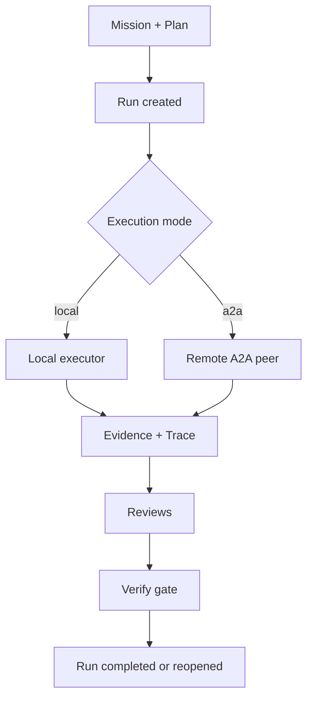

# Architecture

ROI is a local, artifact-native workflow engine and the core execution surface
for Reusable Operational Intelligence.

## Core Components

- **stdio MCP server**
  Runs from `src/server.mjs` and exposes the ROI operation surface.
- **SQLite system of record**
  Persists missions, briefs, plans, runs, tasks, reviews, traces, evidence,
  patterns, and capabilities in `./.data/roi.sqlite`.
- **workflow engine**
  Expands plans into staged tasks and applies review gates before completion.
- **capability registry**
  Matches plans to reusable workflow capabilities and tracks activations.
- **learning loop**
  Detects repeated successful patterns and proposes new reusable capabilities.

## Lifecycle

## Local And Remote Execution

## Durable Object Model

ROI stores work as explicit artifacts so the operating model is inspectable,
durable, and reusable:

- `Mission`
  The outcome being pursued.
- `Brief`
  Clarified problem framing, assumptions, and success criteria.
- `Plan`
  Executable units of work with verification targets and workflow metadata.
- `Task`
  One interruptible execution unit.
- `Run`
  A parent execution record containing staged tasks.
- `ReviewRecord`
  Deterministic review results for workflow gates.
- `Trace`
  Execution events, tool calls, and error signals.
- `Evidence`
  Review and execution artifacts.
- `Pattern`
  Repeated successful activation signal.
- `Capability`
  Reusable workflow behavior, either hand-authored or proposed by
  enlightenment.

## Review-Gated Execution

ROI uses a staged workflow template:

1. `implement`
2. `spec_review`
3. `quality_review`
4. `verify_gate`

A run is not ready for publication until the verify gate is passed. This is a
core design choice, not a convenience feature.

## Routing And Capability Activation

`roi:outline` chooses a capability for a mission or plan and records a routing
decision. `roi:draft` creates a capability activation and executes that
capability's workflow template. Over time, ROI uses activation outcomes and
review results to decide whether repeated work deserves a new reusable
capability proposal.

Reusable operational intelligence is built from evidence and outcomes, not from
one-off execution.

## Trust Boundaries

- Local SQLite is the source of truth.
- MCP is the control plane into the ROI backend.
- A2A can execute bounded remote work, but it does not replace local state.
- Capability promotion remains human-gated.

## Related Docs

- [`state-and-artifacts.md`](./state-and-artifacts.md) — durable artifact
  model, schema/migration policy, and local reset recipe.
- [`limitations.md`](./limitations.md)
- [`../examples/software-engineer-workflows.md`](../examples/software-engineer-workflows.md)
