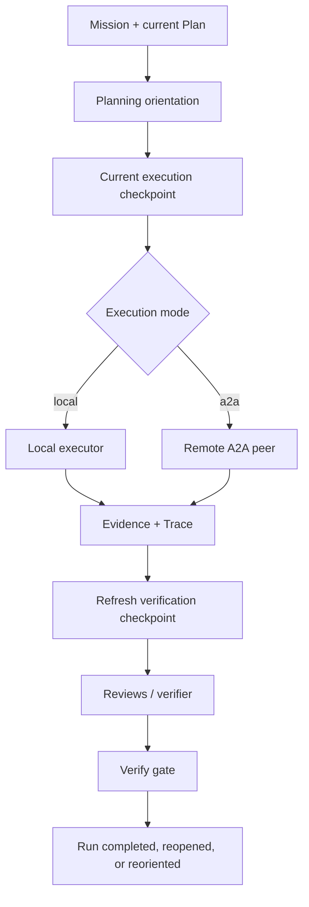

# Architecture

ROI is a local, artifact-native workflow engine and the core execution surface
for Reusable Operational Intelligence.

## Core Components

- **lifecycle helper**
  `scripts/lifecycle.mjs` is the canonical persistence path. Each
  `roi:*` skill shells to `node scripts/lifecycle.mjs <verb> '<json-args>'`
  to dispatch into `ROIService` and persist state. There is no MCP
  server, daemon, or long-running process.
- **SQLite system of record**
  Persists missions, briefs, plans, orientation checkpoints and refresh events,
  runs, tasks, reviews, traces, evidence, patterns, and capabilities in
  `./.data/roi.sqlite`.
- **workflow engine**
  Expands plans into staged tasks and applies review gates before completion.
- **capability registry**
  Matches plans to reusable workflow capabilities and tracks activations.
- **learning loop**
  Detects repeated successful patterns and proposes new reusable capabilities.

## Lifecycle

## Local And Remote Execution

## Durable Object Model

ROI stores work as explicit artifacts so the operating model is inspectable,
durable, and reusable:

- `Mission`
  The outcome being pursued.
- `Brief`
  Clarified problem framing, assumptions, and success criteria.
- `Plan`
  Executable units of work with verification targets, workflow metadata, and
  the revision-owned planning orientation.
- `OrientationCheckpoint`
  An append-only execution or verifier refresh record binding plan revision,
  run/task, owner seams, live-state identity, preconditions, exact next action,
  proof obligations, and any canonical invalidation reason.
- `Task`
  One interruptible execution unit.
- `Run`
  A parent execution record containing staged tasks.
- `ReviewRecord`
  Deterministic review results for workflow gates.
- `Trace`
  Execution events, tool calls, and error signals.
- `Evidence`
  Review and execution artifacts.
- `Pattern`
  Repeated successful activation signal.
- `Capability`
  Reusable workflow behavior, either hand-authored or proposed by
  enlightenment.

## Review-Gated Execution

ROI uses a staged workflow template:

1. `implement`
2. `spec_review`
3. `quality_review`
4. `verify_gate`

A run is not ready for publication until the verify gate is passed. This is a
core design choice, not a convenience feature.

Execution is also orientation-gated. A host mutation or verifier may run only
from a current checkpoint bound to the current plan revision and live state.
The canonical invalidators are `plan_identity_change`, `compaction`, `handoff`,
`material_live_tree_change`, `failed_mutation`,
`verifier_command_invalidation`, `owner_seam_disappearance`, and
`execution_capability_unavailable`. Counts and ContextPack TTL remain
telemetry-only projections over this state.

Executor labels do not alter admission: local, host-agent, and A2A implement
tasks all require task-bound implementation orientation before dispatch.
Deterministic spec and quality reviews are verifier stages and require their
own task-bound checkpoints. Run-associated `roi:go` evidence binds both
mutation and verifier history to the concrete implement task. Checkpoints also
record an evidence-sequence floor so pre-change review orientation cannot be
reused after newer passing `roi:go` evidence.

## Routing And Capability Activation

`roi:outline` establishes planning orientation, chooses a capability for a
mission or plan, and records a routing decision. `roi:go` refreshes execution
orientation before host work. `roi:draft` creates a capability activation and
executes that capability's workflow template. Every verifier refreshes its own
current checkpoint. Over time, ROI uses activation outcomes and review results
to decide whether repeated work deserves a new reusable capability proposal.

Reusable operational intelligence is built from evidence and outcomes, not from
one-off execution.

## Trust Boundaries

- Local SQLite is the source of truth.
- The lifecycle helper is the only persistence path; skills shell to it
  per command and exit cleanly. Hosts compose ROI by registering skills,
  not by speaking a network protocol to a long-running ROI process.
- A2A can execute bounded remote work, but it does not replace local state.
- Capability promotion remains human-gated.

## Related Docs

- [`state-and-artifacts.md`](./state-and-artifacts.md) — durable artifact
  model, schema/migration policy, and local reset recipe.
- [`limitations.md`](./limitations.md)
- [`../examples/software-engineer-workflows.md`](../examples/software-engineer-workflows.md)
