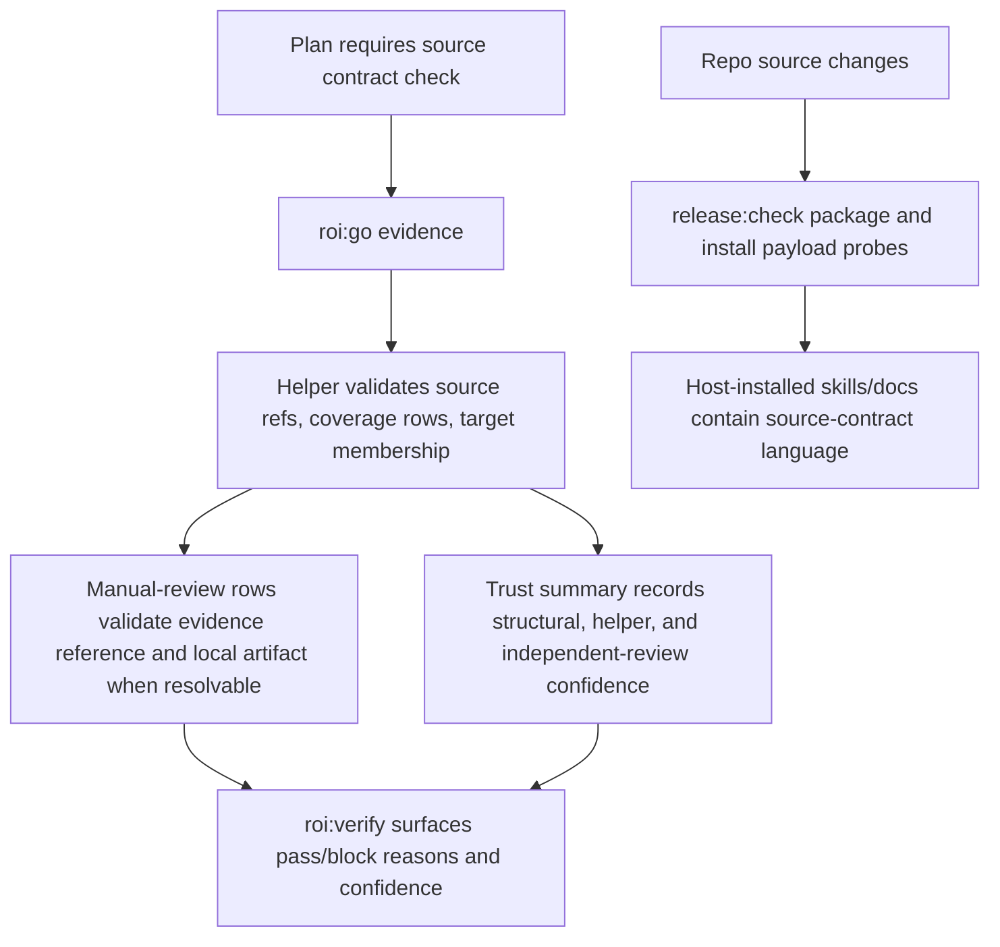

# Fix ROI Source-Contract Residual Risks

## Summary

Harden ROI's source-contract proof lane so residual risk is explicit, inspectable, and release-verifiable. The plan strengthens manual-review evidence references, separates helper-enforced structure from independent semantic review, and adds package/install propagation checks so repo fixes do not silently miss the installed skill surface.

---

## Problem Frame

Recent ROI remediation added source-contract proof fields and helper validation, but three residual risks remain: manual-review rows prove shape rather than artifact adequacy, same-session verification can overstate semantic confidence, and installed Codex plugin/cache state can lag behind repository changes. These are trust-boundary issues, not another generic docs polish pass.

---

## Requirements

- R1. Passing `roi:go` evidence for source-contract plans must reject manual-review rows that do not reference an inspectable proof artifact.
- R2. ROI must keep the semantic adequacy boundary honest: helper checks may validate shape, refs, paths, and review metadata, but must not claim to prove human judgment.
- R3. High-stakes source-contract missions must have an explicit independent-review lane or confidence marker that same-session `npm test` cannot satisfy alone.
- R4. Release and install validation must prove packaged and host-installed ROI skill/docs payloads contain the source-contract guidance needed by operators.
- R5. User-facing docs and skills must present one consistent contract for source contracts, manual review evidence, independent review, and plugin propagation.

---

## Scope Boundaries

- Do not build a general-purpose semantic verifier for manual-review claims; this plan makes human-review evidence inspectable and confidence-labeled.
- Do not replace existing `verification_targets` or `run_oracles: true`; this plan extends the source-contract-specific proof lane.
- Do not require network, GitHub, or remote CI access for ordinary local ROI helper validation.

### Deferred to Follow-Up Work

- Remote CI and git-host proof integration: split out because ROI's current release docs already treat remote CI as outside local lifecycle proof; revive under the D8 remote-proof track when the product has a dedicated CI evidence model.
- External reviewer identity verification: split out because this plan can record independent-review posture without solving account identity; revive when ROI adds authenticated operator profiles or signed review evidence.

---

## Context & Research

### Relevant Code and Patterns

- `src/implementationProof.mjs` owns `sourceContractCoverageIssue`, `sourceContractCoveragePresent`, `implementationProofTrust`, plan target matching, touched-path resolution, and mission progress reason calculation.
- `src/service.mjs` persists plan fields and calls implementation-proof helpers from `evidence_record`, `mission_go_progress`, `status_get`, and verify evaluation paths.
- `src/contracts.mjs` defines plan and evidence request schemas exposed by `scripts/lifecycle.mjs`.
- `test/implementationProof.test.mjs` already covers missing source-contract proof, source-ref mismatch, target mismatch, empty target mismatch, and mission progress behavior.
- `scripts/release-check.mjs` already validates packaged payload shape, extracted-package smoke, and dry-run host installers.
- `scripts/install-agent-skills.sh` owns host install payloads for Claude, Codex, Cursor, and Copilot.
- `skills/roi-outline/SKILL.md`, `skills/roi-go/SKILL.md`, `skills/roi-verify/SKILL.md`, and `AGENTS.md` define the operator-facing lifecycle contract.
- `docs/limitations.md`, `docs/state-and-artifacts.md`, `docs/command-reference.md`, `docs/installation.md`, `docs/release-validation.md`, and `docs/multi-runtime.md` are the public docs that currently describe trust and install boundaries.

### Institutional Learnings

- ROI planning/parser work treats pasted third-party Plans as first-class intake, keeps normalization owned by the invoked stage, and does not fabricate runnable verification commands when validation is absent.
- The recent source-contract remediation established that plan source refs and verification-target membership are helper-enforced, while semantic adequacy remains a human-review boundary.

### External References

- None used. This plan is grounded in the live ROI repository and existing ROI lifecycle contracts.

---

## Key Technical Decisions

- **D1. Inspectable proof reference, not semantic automation:** Manual-review coverage rows must carry evidence that can be inspected, and local repo-relative file references should exist when ROI can resolve them. The helper still reports this as artifact adequacy, not semantic truth.
- **D2. Trust confidence is a first-class output:** Source-contract proof should expose whether it is structurally complete, helper-verified, and independently reviewed instead of compressing all states into pass/fail.
- **D3. Independent review is metadata plus workflow guidance first:** Add a durable independent-review lane that `roi:verify` and docs can surface before requiring authenticated reviewer identity.
- **D4. Propagation proof belongs in release/install validation:** Installed plugin/cache freshness is not a lifecycle evidence property; it belongs in release check and installer smoke coverage.
- **D5. Docs and skills are part of the product contract:** Any helper change must update the invoked ROI skills and public docs in the same delivery so operators do not use stale proof language.

---

## Open Questions

### Resolved During Planning

- **Should ROI try to prove manual-review semantics automatically?** No. ROI should validate references, required fields, local artifact existence where possible, and independent-review metadata, while documenting semantic judgment as a human responsibility.
- **Should installed Codex cache inspection block normal helper validation?** No. It should be a release/install gate and an operator troubleshooting check, not part of `evidence_record`.
- **Should independent review be mandatory for every source-contract plan?** No. It should be required only when the plan or verify request asks for high-confidence source-contract proof; ordinary missions can remain structurally checked.

### Deferred to Implementation

- **Exact metadata field names:** Choose the smallest names that fit existing proof shape during implementation; the plan only requires stable concepts: review mode, reviewer/source label, and review artifact.
- **Which host install paths can be inspected portably:** Determine during installer/release-check implementation because host paths differ by runtime and dry-run behavior.

---

## High-Level Technical Design

> *This illustrates the intended approach and is directional guidance for review, not implementation specification. The implementing agent should treat it as context, not code to reproduce.*

---

## Implementation Units

### U1. Validate Manual-Review Evidence Artifacts

**Goal:** Make manual-review source-contract rows inspectable by rejecting empty or non-resolvable evidence where ROI can safely validate local artifacts.

**Requirements:** R1, R2

**Dependencies:** None

**Files:**
- Modify: `src/implementationProof.mjs`
- Modify: `src/service.mjs`
- Test: `test/implementationProof.test.mjs`
- Test: `test/service.test.mjs`

**Approach:**
- Extend source-contract coverage validation so `manual_review` rows require an evidence reference with a recognized inspectable shape.
- Validate repo-relative local evidence paths when a workspace/package root is available and the reference is not an external URL or opaque artifact ID.
- Return specific blocking reasons that distinguish missing evidence, unresolved local evidence, and malformed evidence from semantic insufficiency.
- Preserve the existing valid cases for external/opaque evidence identifiers so ROI can work outside a single local checkout.

**Execution note:** Start with failing tests around missing evidence, non-existent local evidence, and accepted external/opaque evidence before changing helper behavior.

**Patterns to follow:**
- `resolveTouchedPath`, `resolveProductTreeRoot`, and `normalizeRepoRelativePath` patterns in `src/implementationProof.mjs`.
- Existing source-contract tests in `test/implementationProof.test.mjs`.

**Test scenarios:**
- Error path: a `manual_review` row with no `evidence` is rejected with a manual-review evidence error.
- Error path: a `manual_review` row with a repo-relative evidence path that does not exist is rejected when a workspace/package root is available.
- Happy path: a `manual_review` row with an existing local evidence file is accepted.
- Happy path: a `manual_review` row with an external URL or opaque artifact identifier remains accepted without local file probing.
- Integration: `evidence_record` refuses to count a passing `roi:go` row as substantive when manual-review evidence validation fails.

**Verification:**
- Source-contract plans cannot be closed by a manual-review row whose proof cannot be inspected under the validation mode ROI can apply.

---

### U2. Surface Source-Contract Confidence and Independent Review

**Goal:** Make same-session proof confidence explicit by adding a source-contract review/trust summary that distinguishes structural helper checks from independent semantic review.

**Requirements:** R2, R3

**Dependencies:** U1

**Files:**
- Modify: `src/implementationProof.mjs`
- Modify: `src/service.mjs`
- Modify: `src/contracts.mjs`
- Test: `test/implementationProof.test.mjs`
- Test: `test/service.test.mjs`

**Approach:**
- Add a small source-contract confidence summary derived from the latest substantive `roi:go` evidence.
- Treat existing shape/source-ref/target checks as structural confidence.
- Recognize explicit independent-review metadata or a dedicated quality-review evidence record as higher confidence, without making it mandatory for all missions.
- Add verify/status output fields that let operators and skills see whether source-contract proof is structural-only or independently reviewed.

**Execution note:** Characterize existing `implementation_proof_trust` output before adding source-contract-specific confidence so existing strict-mode behavior stays stable.

**Patterns to follow:**
- `implementationProofTrust` and `status_get.implementation_proof_trust`.
- Quality-review invalidation flow in `missionVerificationPolicy.mjs` and service progress logic.

**Test scenarios:**
- Happy path: structurally valid source-contract proof reports structural source-contract confidence.
- Happy path: source-contract proof with accepted independent-review metadata reports independent-review confidence.
- Edge case: ordinary plans with no source-contract requirement do not surface misleading source-contract confidence.
- Integration: `status_get` and verify evaluation expose the confidence marker without changing existing `implementation_proof_trust` values.

**Verification:**
- Operators can distinguish helper-validated source-contract proof from independently reviewed source-contract proof without reading raw evidence JSON.

---

### U3. Add High-Confidence Verify Gate for Source Contracts

**Goal:** Provide an opt-in verification path that blocks source-contract pass verdicts unless independent review evidence exists for marked plans.

**Requirements:** R2, R3

**Dependencies:** U2

**Files:**
- Modify: `src/contracts.mjs`
- Modify: `src/service.mjs`
- Modify: `skills/roi-verify/SKILL.md`
- Modify: `skills/roi-review/SKILL.md`
- Test: `test/service.test.mjs`
- Test: `test/lifecycle-helper-contract.test.mjs`

**Approach:**
- Add an opt-in verify request control for requiring independently reviewed source-contract proof on run plans.
- Keep default verify behavior compatible: structurally valid source-contract proof can pass unless the stronger control is set.
- Ensure blocked verify results name the missing independent-review confidence rather than collapsing into generic missing proof.
- Update verify/review skills so high-stakes roadmap/doctrine missions instruct operators to use the stronger gate.

**Execution note:** Implement contract and service tests before touching skill text so docs can mirror actual helper behavior.

**Patterns to follow:**
- `require_verified_proof` and `run_oracles` optional verify controls.
- `skills/roi-verify/SKILL.md` trust-level language.

**Test scenarios:**
- Happy path: verify pass succeeds for a source-contract run when independent-review confidence is present and the stronger control is set.
- Error path: verify pass is blocked when the stronger control is set and source-contract proof is only structural.
- Edge case: non-source-contract runs are not blocked by the stronger source-contract control.
- Integration: lifecycle helper schema accepts the new control and rejects malformed values.

**Verification:**
- High-stakes source-contract missions have a deterministic verify-time switch for requiring independent review.

---

### U4. Prove Package and Installed Payload Propagation

**Goal:** Prevent repository/source fixes from drifting away from packaged and host-installed ROI skill payloads.

**Requirements:** R4, R5

**Dependencies:** U1, U2, U3

**Files:**
- Modify: `scripts/release-check.mjs`
- Modify: `scripts/install-agent-skills.sh`
- Modify: `docs/release-validation.md`
- Modify: `docs/installation.md`
- Create: `test/release-check.test.mjs`

**Approach:**
- Add release-check probes that inspect the packaged/extracted skill and docs payload for source-contract guidance, manual-review evidence language, and high-confidence verify guidance.
- Extend installer dry-run or smoke output so host-specific installed payload targets can be inspected consistently.
- Add focused tests around the release-check inspection logic rather than relying only on the full release command.
- Document the operator step for refreshing Codex desktop/plugin cache after repository updates.

**Execution note:** If `test/release-check.test.mjs` does not exist, create a narrow test around pure inspection helpers rather than spawning the full release gate.

**Patterns to follow:**
- Existing `inspectPackage` and `inspectMarketplaceContract` shape in `scripts/release-check.mjs`.
- Existing host-specific install sections in `docs/installation.md`.

**Test scenarios:**
- Error path: release-check fails when packaged `skills/roi-go/SKILL.md` lacks source-contract coverage guidance.
- Error path: release-check fails when packaged docs omit the manual-review evidence boundary.
- Happy path: release-check inspection accepts the current packaged/extracted payload after docs and skills are updated.
- Integration: installer dry-run output names the Codex payload path that an operator can inspect or refresh.

**Verification:**
- `pnpm run release:check` proves the release package and host-install dry runs carry the source-contract proof contract.

---

### U5. Align Skills and Public Docs With the Hardened Contract

**Goal:** Make operator-facing docs describe the same source-contract trust model enforced by code.

**Requirements:** R2, R3, R4, R5

**Dependencies:** U1, U2, U3, U4

**Files:**
- Modify: `AGENTS.md`
- Modify: `skills/roi-outline/SKILL.md`
- Modify: `skills/roi-go/SKILL.md`
- Modify: `skills/roi-verify/SKILL.md`
- Modify: `docs/command-reference.md`
- Modify: `docs/state-and-artifacts.md`
- Modify: `docs/limitations.md`
- Modify: `docs/multi-runtime.md`
- Modify: `docs/troubleshooting.md`

**Approach:**
- Update outline/go guidance so source-contract plans require either runnable targets or manual-review evidence artifacts that can be inspected.
- Update verify guidance to explain default structural checks and the opt-in independent-review gate.
- Update limitations language so the helper's automation boundary is honest and consistent with the new confidence fields.
- Update install/troubleshooting docs to call out stale host plugin/cache behavior and the refresh path.

**Patterns to follow:**
- Existing source-contract sections in `AGENTS.md`, `skills/roi-outline/SKILL.md`, and `skills/roi-go/SKILL.md`.
- Existing trust-boundary table in `docs/limitations.md`.

**Test scenarios:**
- Documentation: docs mention manual-review evidence artifact expectations consistently across command reference, limitations, and state docs.
- Documentation: skills mention the stronger verify gate only where operators make verify decisions.
- Documentation: install/troubleshooting docs explain how to refresh installed ROI payloads after a source checkout or package update.

**Verification:**
- A reader following the skills/docs sees one consistent source-contract proof model and can tell when a local checkout fix has not reached installed host payloads.

---

## System-Wide Impact

- **Interaction graph:** `roi:outline` persists source-contract plans, `roi:go` records implementation proof, `mission_go_progress` decides whether plans are open, `roi:verify` evaluates verdict eligibility, and release/install tooling distributes the skills that teach operators how to use those gates.
- **Error propagation:** Helper validation failures should remain explicit strings in evidence/verify errors so skills can report actionable next steps without parsing generic exceptions.
- **State lifecycle risks:** New confidence fields must be derived from durable evidence and latest plan revisions; stale evidence for superseded revisions must not produce high confidence.
- **API surface parity:** CLI helper schemas, skill instructions, AGENTS guidance, public docs, and release-check expectations must change together.
- **Integration coverage:** Unit tests cover validation helpers; service/lifecycle tests cover persistence and gate behavior; release-check tests cover package/install payload drift.
- **Unchanged invariants:** Existing default verification, strict `require_verified_proof`, `run_oracles: true`, and `implementation_proof_trust` semantics remain intact.

---

## Risks & Dependencies

| Risk | Mitigation |
|------|------------|
| Helper overclaims semantic assurance | Keep semantic review explicitly human-owned; expose structural vs independent confidence. |
| New manual-review path checks reject valid external artifacts | Accept external URLs and opaque artifact IDs without local path probing; only enforce local existence for references ROI can resolve safely. |
| Verify gate breaks existing missions | Make independent source-contract review opt-in, with default compatibility preserved. |
| Release-check becomes brittle against docs wording | Check for durable concepts and required files, not long exact prose blocks. |
| Installed Codex desktop plugin cache still lags after release | Document the manual refresh path and make release/install validation prove the payload content, not desktop UI state. |

---

## Documentation / Operational Notes

- Treat this as a proof-contract hardening release note: it changes what operators must provide for source-contract missions.
- Update release notes or changelog after implementation if the helper rejects evidence that was previously accepted.
- Include an operator-facing warning that source-contract pass means "structurally represented" unless the independent-review gate is used and satisfied.

---

## Sources & References

- Related code: `src/implementationProof.mjs`
- Related code: `src/service.mjs`
- Related code: `src/contracts.mjs`
- Related tests: `test/implementationProof.test.mjs`
- Related tooling: `scripts/release-check.mjs`
- Related installer: `scripts/install-agent-skills.sh`
- Related skill docs: `skills/roi-outline/SKILL.md`, `skills/roi-go/SKILL.md`, `skills/roi-verify/SKILL.md`
- Related docs: `docs/limitations.md`, `docs/state-and-artifacts.md`, `docs/command-reference.md`, `docs/installation.md`, `docs/release-validation.md`, `docs/multi-runtime.md`
