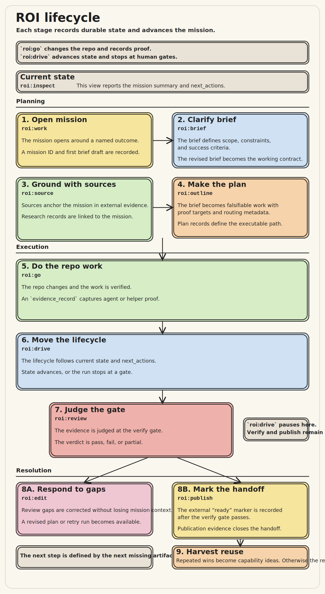

# ROI Quickstart

This quickstart gets you from a release tarball or checkout to one complete ROI
mission lifecycle.

> **Coming from Compound Engineering skills?** See the
> [CE → ROI migration guide](./from-ce.md) for a host-specific walkthrough
> (Claude Code, Codex, Copilot CLI) and a command mapping table that maps
> every `ce:*` command to its ROI equivalent.

## Prerequisites

- Node.js `>=24`
- pnpm
- terminal access inside either the checked-out `roi/` directory or the unpacked
  tarball `package/` directory

## 1. Prepare The Package

If you received a release tarball:

```bash
shasum -a 256 -c roi-plugin-0.1.1.tgz.sha256
tar -xzf roi-plugin-0.1.1.tgz
cd package
pnpm install --frozen-lockfile
```

If you have a checkout, run this from `roi/`:

```bash
pnpm install
```

## 2. Validate The Bundle

Run the full release gate first:

```bash
pnpm run release:check
```

If this fails, fix the environment before proceeding. The ROI package assumes
the release gate is the baseline integrity check for handoff.

## 3. Choose A Host

ROI is skill-driven. Each host integrates by registering the ROI skill
plugin (or, for Cursor, a vocabulary rule); skills shell to
`scripts/lifecycle.mjs` per command. There is no MCP server to start.

- Cursor: open the ROI package root that ships `.cursor/rules/roi-commands.mdc`.
- Codex: install the ROI skill plugin (`scripts/install-agent-skills.sh codex`).
- GitHub Copilot CLI: install the ROI skill plugin
  (`scripts/install-agent-skills.sh copilot`).
- Claude Code: install the ROI skills
  (`scripts/install-agent-skills.sh claude-user`).

See [`installation.md`](./installation.md) for exact host steps.

For backend smoke checks without a host, drive the helper directly:

```bash
node scripts/lifecycle.mjs --list-verbs
node scripts/lifecycle.mjs mission_list '{}'
```

By default, ROI persists data in:

```text
.data/roi.sqlite
```

The database file is created on first use. Set `ROI_SQLITE_PATH` for
isolated experiments or parallel sessions.

## 4. Create A Sample Mission

Use [`../fixtures/reference-mission.json`](../fixtures/reference-mission.json)
as the canonical example shape. A minimal mission looks like this:

```json
{
  "title": "Deliver ROI Plugin v1",
  "goal": "Ship a self-contained ROI plugin with skill-driven lifecycle, SQLite durability, local and A2A execution, review, publication, and learning."
}
```

## 5. Walk The Lifecycle

**Two commands, two loops:**

- **`roi:go [mission]`** — implement plans in the product repo, run
  `verification_targets`, record verification evidence (`skills/roi-go/SKILL.md`).
- **`roi:drive [mission]`** — advance ROI lifecycle (runs, verify gate,
  publish); does not implement code (`skills/roi-drive/SKILL.md`).

Recommended after outlining: `roi:go` → `roi:drive`. In Claude Code, Codex, and
Copilot CLI, use `$roi-go` / `$roi-drive` from the skill picker (see
[`installation.md`](./installation.md)). In Cursor, use the vocabulary in
`.cursor/rules/roi-commands.mdc`. The numbered steps below are manual
step-by-step control.

Before the step list, use this sketch to anchor the intent and durable outcome
of each stage:



Use the top-level ROI command surface in this order:

1. `roi:work`
    Creates the mission and seeds the first brief revision.
2. `roi:brief`
    Adds assumptions, constraints, and success criteria.
3. `roi:source`
   Records the source material and findings the draft will rely on.
4. `roi:outline`
    Generates or stores plans, assigns routing, and stamps workflow metadata.
5. `roi:draft`
    Expands the selected plan into staged tasks and advances execution.
    It can first pause for task-bound orientation admission. Follow its
    `next_actions`: use `roi:go` for an implementation admission pause and
    `roi:review` for spec, quality, or verification admission and review work.
6. `roi:review`
   Closes the review gate with explicit evidence and a verdict.
7. `roi:edit`
   Revises the outline or launches a follow-on draft when review finds gaps.
8. `roi:publish`
   Records the handoff-ready state once the draft is acceptable.
9. `roi:learn`
   Detects repeated successful patterns and creates human-gated capability
   proposals. A `noop` result is expected until 3+ successful runs exist.
10. `roi:inspect`
    Reads the durable mission state. Available **at any point**, not only
    after publication.

## 6. What To Expect

On the first green-path run:

- `roi:draft` may first pause for task-bound orientation admission; after
  task evidence is current, it pauses at `verify_gate` for the verdict
- `roi:inspect` should show:
  - one or more plans
  - staged tasks
  - routing decisions
  - capability activations
  - review records
- `roi:review` should move the run toward `roi:edit`, `roi:publish`, or direct
  completion
- On a full pass, `roi:review` completes the run, clears superseded blockers
  from `roi:inspect`, and surfaces `roi:publish` plus `roi:learn` in
  `next_actions`
- `roi:publish` marks the handoff boundary once the run is ready
- `roi:learn` may return `noop` until enough repeated successful
  activations exist

## 7. Inspect State

Use `roi:inspect` as the primary operator view **at any point in the
lifecycle**, not only after publication. It summarizes:

- latest brief and plans
- task and run states
- policy decisions
- review records
- patterns and capability proposals
- next recommended actions

## 8. Reset Local State

Helper invocations are short-lived subprocesses, so nothing keeps the
database open between commands. Remove the local database and its WAL
sidecars when you want a clean slate:

```bash
rm -f .data/roi.sqlite .data/roi.sqlite-wal .data/roi.sqlite-shm
```

Use this only for local experimentation. It deletes all mission state.

## Next Docs

- [`installation.md`](./installation.md)
- [`command-reference.md`](./command-reference.md)
- [`architecture.md`](./architecture.md)
- [`../examples/software-engineer-workflows.md`](../examples/software-engineer-workflows.md)
